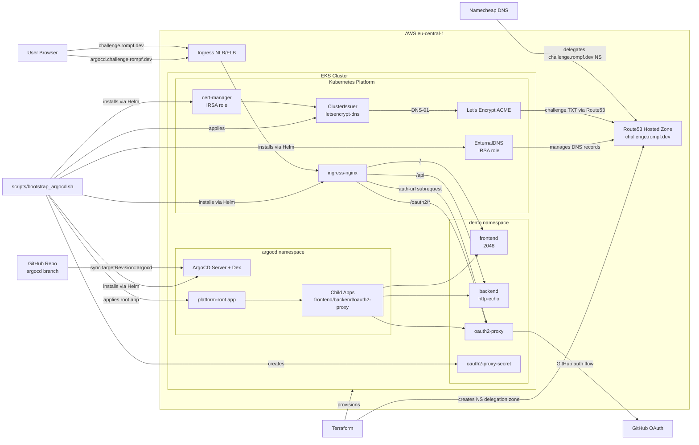

# Datavisyn DevOps Challenge (ArgoCD Branch)

This branch contains the GitOps implementation of the challenge. It provisions EKS with Terraform and deploys the platform and apps declaratively via ArgoCD.

The deployed stack includes:

- AWS EKS + VPC via Terraform
- Route53 delegated subdomain (`challenge.rompf.dev`)
- ingress-nginx
- ExternalDNS (IRSA)
- cert-manager with ACME DNS-01 (IRSA)
- ArgoCD with GitHub login (Dex connector)
- `frontend` (2048), `backend` (http-echo), and `oauth2-proxy`
- OAuth protection for frontend/backend through ingress external auth

If you want the imperative reviewer flow, use `master`. This README is for `argocd`.

## Prerequisites

This guide is designed for **macOS** and **Linux**. Windows users should use [WSL 2](https://learn.microsoft.com/en-us/windows/wsl/install).

**AWS Credentials:**  
Configure your AWS credentials before proceeding. See the [AWS CLI Configuration Guide](https://docs.aws.amazon.com/cli/latest/userguide/getting-started-quickstart.html).

**Required Tools:**

All of the following tools must be installed:

| Tool | Version | Installation |
|------|---------|--------------|
| **Terraform** | >= 1.5.0 | [Download](https://www.terraform.io/downloads) • [Homebrew](https://formulae.brew.sh/formula/terraform) |
| **kubectl** | >= 1.27 | [Download](https://kubernetes.io/docs/tasks/tools/) • [Homebrew](https://formulae.brew.sh/formula/kubernetes-cli) |
| **Helm** | >= 3.12 | [Download](https://helm.sh/docs/intro/install/) • [Homebrew](https://formulae.brew.sh/formula/helm) |
| **AWS CLI** | v2 | [Download](https://docs.aws.amazon.com/cli/latest/userguide/getting-started-install.html) • [Homebrew](https://formulae.brew.sh/formula/awscli) |
| **sops** | >= 3.8 | [GitHub](https://github.com/getsops/sops#installation) • [Homebrew](https://formulae.brew.sh/formula/sops) |
| **GPG** | >= 2.2 | [Download](https://gnupg.org/download/) • [Homebrew](https://formulae.brew.sh/formula/gnupg) |

Verify your installations:

```bash
terraform version
kubectl version
helm version
aws --version
jq --version
openssl version
git --version
```

AWS credentials must be configured before applying Terraform.

## High-Level Flow

1. Terraform provisions EKS and DNS/IAM foundations.
2. `bootstrap_argocd.sh` installs platform controllers.
3. ArgoCD deploys app-of-apps (`platform-root`) from this repo.
4. Ingress routes `challenge.rompf.dev` through oauth2-proxy auth.

## Architecture



## 1) Provision Infrastructure

We can run the following command to provision the entire infrastructure in AWS:

```bash
git clone git@github.com:RompfRobert/datavisyn-devops-challenge.git && cd datavisyn-devops-challenge && git checkout argocd && cd terraform && terraform init && terraform apply -auto-approve && cd ..
```

Using terraform outputs it's easy to configure kubeconfig:

```bash
aws eks update-kubeconfig \
   --region "$(terraform -chdir=terraform output -raw region)" \
   --name "$(terraform -chdir=terraform output -raw cluster_name)"
```

Before we proceed, it is important to do the following step. In the terraform output, there will be the `delegated_zone_name_servers`, to set up Route53 to manage the subdomains we need to delegate the `challenge.rompf.dev` NS records at our registrar before continuing. This looks different for every registrar but the fundamentals are the same.

## 2) Create GitHub OAuth Apps

Create two OAuth Apps in GitHub Developer Settings.

App OAuth (for `challenge.rompf.dev`):

- Homepage URL: `https://challenge.rompf.dev`
- Callback URL: `https://challenge.rompf.dev/oauth2/callback`

ArgoCD OAuth (for `argocd.challenge.rompf.dev`):

- Homepage URL: `https://argocd.challenge.rompf.dev`
- Callback URL: `https://argocd.challenge.rompf.dev/api/dex/callback`

Keep both client IDs and secrets ready.

## 3) Bootstrap Platform + ArgoCD

Run:

```bash
./scripts/bootstrap_argocd.sh
```

> Before you run the bootstrap, be sure the change the domain to YOUR domain in the code otherwise it's going to use `rompf.dev`

The script will:

- read Terraform outputs for region, hosts, zone, and IRSA roles
- print Route53 nameservers for delegation
- ask for OAuth credentials and Let's Encrypt email
- install ingress-nginx, ExternalDNS, cert-manager, and ArgoCD
- create `letsencrypt-dns` ClusterIssuer
- create `demo/oauth2-proxy-secret`
- apply `argocd/root-application.yaml`

## 4) Verify Deployment

ArgoCD apps:

```bash
kubectl -n argocd get applications.argoproj.io -o wide
```

Expected apps:

- `platform-root`
- `frontend`
- `backend`
- `oauth2-proxy`

Ingresses:

```bash
kubectl get ingress -A
```

Expected hosts:

- `argocd.challenge.rompf.dev`
- `challenge.rompf.dev` (frontend/backend/oauth2-proxy paths)

Certificates:

```bash
kubectl -n demo get certificate
```

Expected:

- `challenge-rompf-dev-tls` is `READY=True`

DNS:

```bash
nslookup challenge.rompf.dev
nslookup argocd.challenge.rompf.dev
```

## Visual Proof

Here we can see the argocd homepage:


Next if we wish to authenticate with GitHub Login:


After succesfully authenticating, we can access the dashboard:


If we go to the App Homepage we will be prompted with the same GitHub auth and after we authenticate, we can see the app:


The same applies for the backend:


## Architecture Notes

- ArgoCD uses app-of-apps (`argocd/root-application.yaml`) with child apps in `argocd/apps/`.
- `oauth2-proxy` runs with `secret.create=false` and references `oauth2-proxy-secret`.
- Frontend/backend ingress auth uses:
  - `nginx.ingress.kubernetes.io/auth-url: http://oauth2-proxy.demo.svc.cluster.local:4180/oauth2/auth`
  - `nginx.ingress.kubernetes.io/auth-signin: https://challenge.rompf.dev/oauth2/start?rd=$escaped_request_uri`
- TLS is owned by frontend ingress (`challenge-rompf-dev-tls`) via cert-manager.
- Frontend/backend services use `internalTrafficPolicy: Local` and are scaled to 2 replicas with pod anti-affinity for node-local resilience.

## ArgoCD Login and App Visibility

ArgoCD login is configured via Dex + GitHub OAuth.

To ensure GitHub users can see apps by default, the cluster RBAC config should include:

- `argocd-rbac-cm.data.policy.default = role:admin`

This default is baked into `scripts/bootstrap_argocd.sh` for new environments.

## Cleanup

```bash
./scripts/reset_cluster.sh && cd terraform && terraform destroy -auto-approve && cd ..
```
